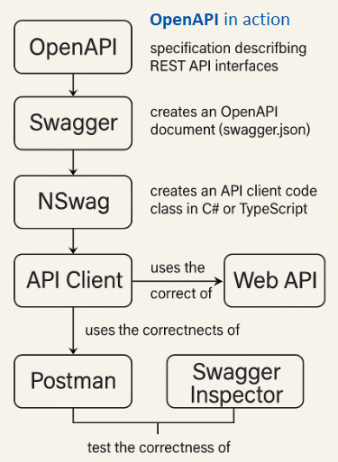

# OpenAPI - specification describing the REST API interface.

## Overview

ASP.NET allows you to create MVC and WebAPI servers.

MVC web servers - as a product they provide html websites to the client. The client receives visual content in the browser for direct use, can read, click, take actions and use this page independently without other tools.

It is different in the case of the WebAPI server - there the client receives raw data in the form of JSON which is difficult to use directly.

Therefore, the client must still process this data on its side and present it in a readable version. Therefore, it must know the structure of this data and know what it means. Usually, WebAPI provides many endpoints, so the client must have a list of them and how to use them.

Therefore, it needs some set of information about the functionality of the WebAPI server.

The OpenAPI specification deals with creating such a set of information about the functionality of the WebAPI server.

## 🌐 WebAPI – Key Mechanisms and Tools

* **WebAPI** is a backend service that exposes data through **HTTP endpoints**, usually returning JSON.

* **OpenAPI** is a standard that describes how the API works — endpoints, inputs, and outputs — in a clear, machine-readable way.

* The **Swagger document** (swagger.json or swagger.yaml) is an OpenAPI file auto-generated by your app. It defines the API according to the OpenAPI specification.

* **NSwag** is a tool (used by Visual Studio and others) that reads the Swagger file and generates ready-made **API client** code in C# or TypeScript.

* **Connected Services** in Visual Studio uses NSwag behind the scenes to generate this client. It saves time and reduces errors.

* This **API client** is a library that lets your app (e.g., WinForms, Angular, Blazor, mobile) call the WebAPI easily, without manually building HTTP requests.

* **Postman, Swagger Inspector**, and **Dredd** are tools that can import swagger.json and test your API — checking correctness, speed, and response structure.

* The whole system helps developers build, consume, and validate Web APIs efficiently and consistently.

## Operation diagram

Therefore, the use of the OpenAPI specification by the developer takes place in stages:

* OpenAPI - a specification describing REST API interfaces.
* Swagger - creates an OpenAPI document (swagger.json) based on the specification;
* NSwag - – based on swagger.json creates API client code class in C# or TypeScript;
* User uses API client to communicate with WebAPI server;
* Postman, Swagger Inspector test correctness of WebAPI server operation;

## This project

This project in file [swagger_SWebAPI_6Client.cs] contains API client generated by NSwag for WebAPI shared in previous project: <a href="https://github.com/janluksoft/Node_Express_TS_Rest_Api"><b>AspNet_RestAPI</b></a>

---
